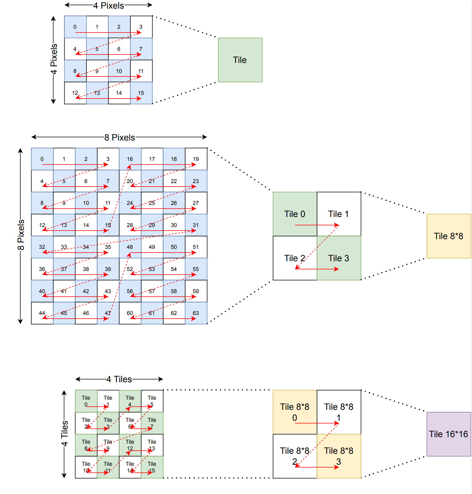

# Texture Tiles Map (TTM) Converter for Bitmaps (BMP)
This program is wrote for converting bitmaps to texture tiles map or convert it back. 

## Format of Texture Tiles
The texture tiles has 3 of format, which are 4x4, 8x8 and 16x16. 
The 4x4 texture tile is the smallest tile block. It has a edge length of 4 pixels both X and Y direction,
contains 16 pixels. In the tile block, the pixels stored in rows of 4. And 16 pixels stored in a Z. 
The 8x8 tile is the higher level storage of 4x4 tile. Each 8x8 tile has 4 of 4x4 tile, which stored in a Z, like the pixels in 4x4 tile. The principle of 16x16 tile is same as the 8x8 tile, it contains 4 of 8x8 tile and stored them in a Z. 
The whole image contains many 16x16 tiles and stored them continuously in-lined. 

## Format of Texture Tile Map File
The texture tile map file is a simple format to store Texture Tiles. 
The file has a head at the start, contains 2 of 32-bit fields. They descript the width and height of the image (in pixels). These two fields are all stored in little-endian. (For example, the image size of (1440 x 64) is stored as A0 05 00 00 40 00 00 00). 
And, the next data are all pixel data, which stored as the tile format. Each pixel is 32-bit, contains A, R, G, B fields. Each piexl stored in the order of A, R, G, B. (For example, the pixel (R = 127, G = 0, B = 128, A = 255) is stored as FF 7F 80 00). 

## Program Usage
The program is easy to use, it contains two arguments and two optional arguments.
The usage of program is 
> ./ttm_convert [-r][-h] <input_file> <output_file>

-r: means you want to convert back from a Texture Tile Map file to Bitmap.
-h: will shows you the help of usage
<input_file>: is the input file of the program. When you in the normal mode (without -r), the input file is a Bitmap file. Otherwise, the input file is a Texture Tile Map file. 
<output_file>: is the output file of the program. You can specific a file name to output. If the file is already existed, the file will be overwritten. 

## Source, Requirement & Compile
The release version of this program is compiled on a Linux machine with GCC 12. 
If you want to re-compile the program, you need to clone this repository and compile the source by yourself. 
You can use any of compilers like GCC, LLVM and MSVC, and target it to any platform (Windows or Linux/x86 or ARM). This program has no dependency of any platform or framework. 
The requirement of this program is the [CImageMatrix](https://github.com/Aperture-Electronic/CImageMatrix) library and the [CBitmap](https://github.com/Aperture-Electronic/CBitmap) library, which you can clone them in my Git repository. 
To let the git clone resolve the library requirements, please use the clone command like: 
> git clone https://github.com/Aperture-Electronic/CTextureTile.git --recursive

